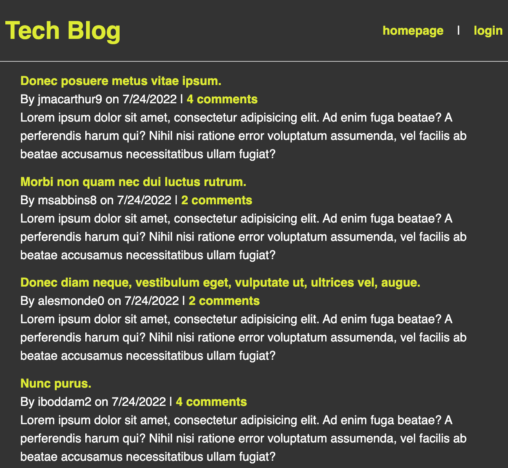

# Challenge 14 Tech Blog

## Project Purpose

A tech-centric blogging website that supports multiple users, post editing, and commenting.

## App Built With

- JavaScript ES6 / ES2015
- Node.js
- Express.js
- npm
- MySQL
- MySQL2 (npm package)
- Sequelize (npm package)
- Dotenv (npm package)
- Express-Session (npm package)
- Connect-Session-Sequelize (npm package)

## Usage

Visit https://lit-wildwood-84509.herokuapp.com/

The app works like a normal blog site. Click Login to join the site or to sign in. Once signed in, visit the dashboard to create a new post, and to view or edit existing posts. Commenting on posts becomes available once signed in as well.

## Contributors

Made with ❤️ by Joe Gallina
